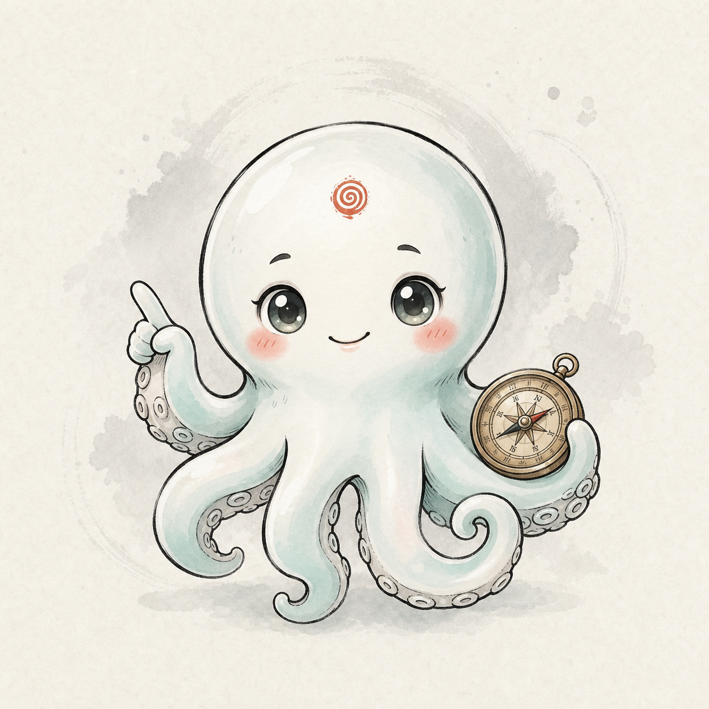

# 湾区罗盘 / 时空罗盘 · 新手引导系统框架 V0.2

> 状态：产品与视觉框架草案，仅新增设计稿资产，不改线上交互代码  
> 日期：2026-07-09  
> 角色概念稿：`public/onboarding/octopus-guide-concept-2026-07-09.png`

## 0. 目标与 Aha Moment

首次进入的用户需要在 1-3 分钟内明白：

- 这不是普通景点地图，而是一张能把「地点、历史人物、文化事件、路线、印章」串起来的文化导航图。
- 最重要的第一步不是看说明，而是亲手完成一次「发现附近锚点 -> 打开故事 -> 规划路线 / 留下记忆」。
- 产品的长期循环是：探索锚点 -> 读故事 / 玩副本 -> 点亮印章 -> 形成路线与个人记忆。

引导不是功能说明书，只教 20% 的关键动作，让用户尽快摸到产品价值。

## 1. 引导时机

### 首次进入自动触发

- 条件：地图加载完成、`#main-actions` 已渲染、用户没有正在登录/注册、没有打开锚点详情或路线面板。
- 触发：本机不存在 `baycompass_onboarding_v2_done`。
- 延迟：地图可交互后 600-900ms 再出现，避免和加载态抢注意力。
- 跳过：欢迎层、每一步气泡都提供「跳过」；跳过后记为已完成，但可从帮助入口重看。

### 上下文二次引导

- 首次打开「留下记忆」时，只解释照片/文字/位置会形成个人记忆点，不强迫发布。
- 首次打开「路线规划」时，强调这是路线概览，实时导航交给腾讯地图。
- 首次完成副本时，引导用户去「印章册」查看刚获得的印章。

### 手动重看

- 在右上角工具区或设置/帮助入口增加「重看新手引导」。
- 多语言版本复用同一状态机，文案走 i18n。

## 2. 引导形式

### 推荐组合

1. 欢迎浮层：章鱼向导出场，一句话建立产品心智。
2. Coach Marks 高亮遮罩：逐步高亮真实 UI，不做独立教程页。
3. 任务式进度：`1/5` 到 `5/5` 的轻量进度，不做游戏化大面板。
4. 真实点击：关键步骤让用户点击真实按钮，系统验证动作完成后进入下一步。
5. 完成反馈：朱砂盖章式收尾，提示「已会用罗盘三件事」。

### 不采用

- 不做长篇营销式首屏。
- 不把所有功能一次讲完。
- 不每次进入都弹。
- 不让章鱼进入锚点详情正文区域，避免和历史叙事争抢空间。

## 3. 引导内容脚本

### Step 0 · 欢迎

- 形式：地图上方出现半透明瓷白浮层，背景地图仍可见。
- 章鱼动作：从底部轻微上浮，招手。
- 文案：`我是小章，你的罗盘向导。用一分钟，带你把湾区从地图看成故事。`
- 动作：`开始引导` / `跳过`

### Step 1 · 发现附近

- 高亮目标：底部 `#explore-btn`，按钮文案「探索附近」。
- 章鱼动作：触手指向按钮。
- 文案：`先从身边开始。点这里，看看附近有哪些文化锚点。`
- 交互：用户真实点击按钮，打开探索面板后自动进入下一步。
- 失败兜底：GPS 不可用时提示系统会回退到福田中心模拟定位。

### Step 2 · 认识一个锚点

- 高亮目标：探索面板中的第一条附近锚点，或地图上当前最推荐 pin。
- 文案：`每个锚点都不是孤立景点，它会告诉你一个小事件如何连接到今天。`
- 交互：用户点击锚点，触发地图 fly-to 与详情面板。

### Step 3 · 玩一次剧情 / 点亮印章

- 高亮目标：锚点详情底部「剧情副本」入口，或已有的印章/副本 CTA。
- 文案：`想记住它，就完成一个小副本。答对后会点亮一枚印章。`
- 交互：此步可以只展示，不强制进入副本；提供 `以后再玩`。

### Step 4 · 生成一条路线

- 高亮目标：底部 `#route-btn`，按钮文案「路线规划」。
- 文案：`把几个锚点串起来，就能生成一条探索路线。这里给的是概览，不替代实时导航。`
- 交互：点击路线规划；如果用户已选锚点，可带入；否则推荐热门路线 tab。

### Step 5 · 留下你的记忆

- 高亮目标：底部 `#memory-btn`，按钮文案「留下记忆」。
- 文案：`到过这里、想到什么，都可以钉在地图上，变成你的湾区记忆。`
- 交互：只打开入口并说明，不强制登录或发布。

### 完成反馈

- 章鱼动作：拿出小朱砂印章轻盖一下。
- 文案：`你已经会用罗盘探索、串路线、留下记忆了。接下来，地图交给你。`
- 动作：`进入地图`

## 4. 交互方式

### 遮罩与定位

- 使用全屏 onboarding layer，遮罩只弱化背景，不让地图完全变黑。
- 对目标元素做高亮挖洞，周围保留 8-12px 呼吸空间。
- 气泡跟随目标位置，桌面优先目标右侧/上方，移动端优先底部 sheet。
- 每一步都需要 `上一步 / 下一步 / 跳过`，真实点击步骤则显示 `点这里继续`。

### 真实操作验证

- `#explore-btn`：监听探索面板 `.open`。
- 锚点：监听详情面板打开或当前选中 anchor 变化。
- `#route-btn`：监听路线面板 `.open`。
- `#memory-btn`：监听记忆面板打开。

### 可访问性

- ESC 关闭当前引导。
- 气泡使用 `role="dialog"` 或 `aria-live="polite"`。
- 所有文案对比度达到 WCAG AA。
- `prefers-reduced-motion: reduce` 下取消章鱼漂浮、盖章位移和遮罩过渡，只保留静态状态。

## 5. 章鱼向导角色设计

### 角色设定

- 名称：小章 / Compass Octo。
- 性格：聪明、温和、话少，像现场讲解员的小助手。
- 职责：只在引导、空状态、完成反馈出现；不常驻遮挡地图。

### 视觉方向

- 主色：瓷白 + 玉青，贴合 `Porcelain` 与 `Jade Cyan`。
- 点睛：少量朱砂，呼应印章系统。
- 线条：水墨黑描边，边缘清晰，便于缩小显示。
- 道具：小古铜罗盘，强化「时空罗盘」心智。
- 禁止：霓虹、紫蓝渐变、赛博城市、发光球、复杂背景、过度幼态玩具感。

### 动作库建议

- `wave`：欢迎招手。
- `point`：触手指向被高亮按钮。
- `think`：锚点故事说明时轻微眨眼。
- `stamp`：完成引导时盖章。
- `idle`：静态悬停，移动端不要循环大幅动画。

### 当前概念稿

后续正式接入时，建议再输出透明背景 PNG/WebP cutout，并补充 2-3 个动作姿态。

## 6. 工程落地约束

- 保持当前 no-build 架构：原生 ES Modules + CSS，不引入 React、Vite、Framer Motion。
- 新增独立 `onboarding` 控制器即可，不侵入 `ui.js` 的核心渲染。
- 状态机：`welcome -> explore -> anchor -> episode -> route -> memory -> done`。
- 本地持久化：`localStorage.setItem('baycompass_onboarding_v2_done', 'true')`。
- 版本升级：如引导内容变化，可改 key 或记录 `version: 2`。
- 埋点建议：开始、每步完成、跳过、完成、重看、首次探索/路线/记忆转化。

## 7. 验收标准

- 首次用户 60-90 秒内完成主引导。
- 引导层不遮挡地图 attribution 和系统关键控制。
- 桌面 1440、平板 768、移动 390 都不重叠、不溢出。
- GPS 失败、路线服务失败、未登录状态都有兜底文案。
- 完成后不会再次自动弹出。
- 章鱼角色增强理解，但不成为主界面常驻噪音。
